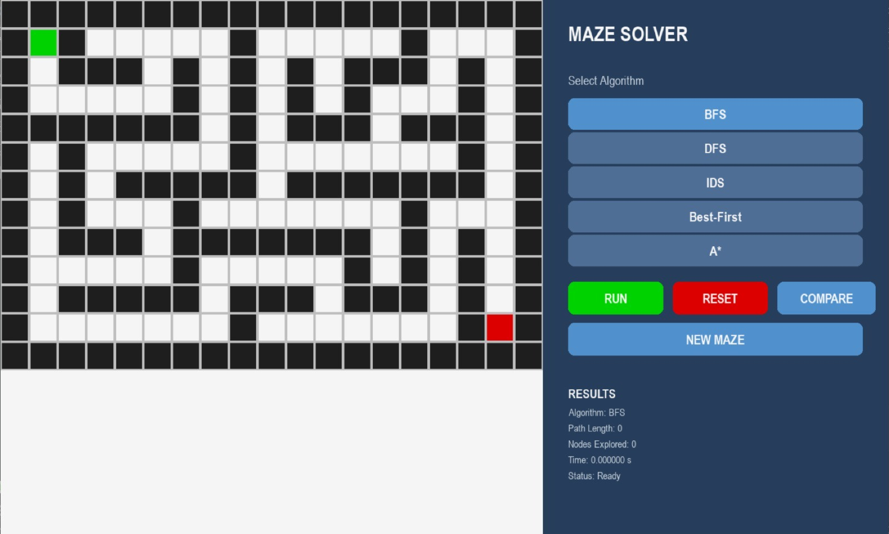
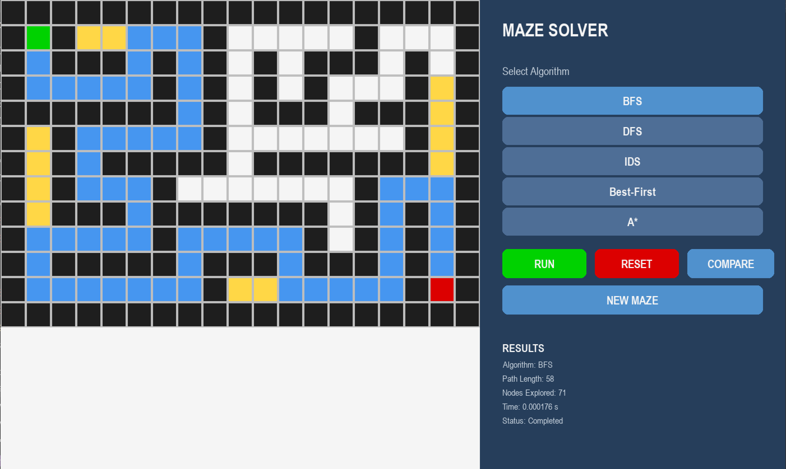
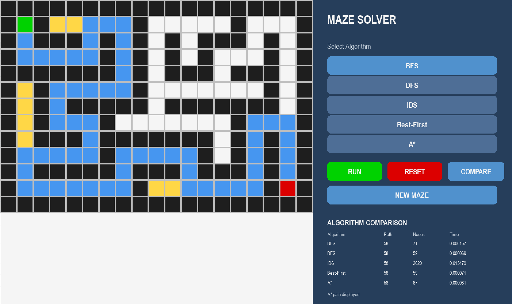

# Intelligent Maze Solver

## Overview
Intelligent Maze Solver is an interactive Pygame application that visually demonstrates and compares different pathfinding and search algorithms on dynamically generated grid-based mazes. 

## Objectives
The primary objective of this project is to provide a visual playground to understand the behavior of different search algorithms in solving a maze. By observing how each algorithm explores nodes and finds paths, users can intuitively grasp concepts like completeness, optimality, and time complexity.

## Features
- **Dynamic Maze Generation**: Generates random mazes using Depth-First Search (Recursive Backtracking).
- **Interactive Visualization**: Real-time rendering of algorithm exploration and path reconstruction.
- **Performance Comparison**: A built-in comparison tool to benchmark algorithms against each other on the same maze based on Path Length, Nodes Explored, and Execution Time.

## Algorithms Implemented

### 1. Breadth-First Search (BFS)
Explores the maze level-by-level, guaranteeing the shortest path in an unweighted grid.

### 2. Depth-First Search (DFS)
Explores as deep as possible before backtracking. Does not guarantee the shortest path and often generates winding solutions.

### 3. Iterative Deepening Search (IDS)
Combines the space-efficiency of DFS with the completeness of BFS by repeatedly applying depth-limited search with increasing limits.

### 4. Greedy Best-First Search
A heuristic-based algorithm that prioritizes nodes closest to the goal. It is fast but does not guarantee the optimal path.

### 5. A* Search
An optimal heuristic search algorithm that balances the cost to reach a node (`g`) and the estimated cost to the goal (`h`). Guarantees the shortest path while exploring fewer nodes than BFS.

## Heuristic Function
For **Greedy Best-First Search** and **A* Search**, this project utilizes the **Manhattan Distance** heuristic.

Since the agent is restricted to moving vertically and horizontally in a grid-based maze, Manhattan distance perfectly estimates the remaining distance to the goal without overestimating it (which is a requirement for A* optimality).

Formula:
```math
h(n) = |x_n - x_g| + |y_n - y_g|
```

## Technologies Used
- **Python 3.x**
- **Pygame** (Rendering and UI)

## Project Structure
```text
User
  │
  ▼
Pygame Interface
  │
  ▼
Maze Environment
  │
  ├── Maze Generator (DFS Backtracking)
  │
  └── Search Algorithm
          │
          ├── BFS
          ├── DFS
          ├── IDS
          ├── Greedy Best-First
          └── A*
          │
          ▼
      Solution Path
          │
          ▼
     Visualization
```

## Installation

1. Clone the repository:
```bash
git clone https://github.com/nithya-lekhana/Intelligent-Maze-Solver.git
cd Intelligent-Maze-Solver
```

2. Create and activate a virtual environment:
```bash
# Windows
python -m venv .venv
.venv\Scripts\activate

# macOS / Linux
python3 -m venv .venv
source .venv/bin/activate
```

3. Install requirements:
```bash
pip install -r requirements.txt
```

## How to Run
```bash
python main.py
```

## Algorithm Comparison

| Algorithm         | Complete | Optimal | Heuristic |
| ----------------- | -------- | ------- | --------- |
| BFS               | Yes      | Yes     | No        |
| DFS               | No       | No      | No        |
| IDS               | Yes      | Yes     | No        |
| Greedy Best-First | No       | No      | Yes       |
| A*                | Yes      | Yes     | Yes       |

*(Note: Completeness and Optimality assume uniform cost per step on a finite grid)*

The application records path length, nodes explored, and execution time for each algorithm, allowing their behavior to be compared on the generated maze.

## Screenshots

### Main Interface


### BFS Execution


### Algorithm Comparison


## Academic Project
This project was developed as part of a Problem-Based Learning (PBL) project at **Woxsen University**.

## Author
**Nithya Lekhana**  
B.Tech Computer Science Engineering  
Specialization: Artificial Intelligence and Machine Learning  
Woxsen University
